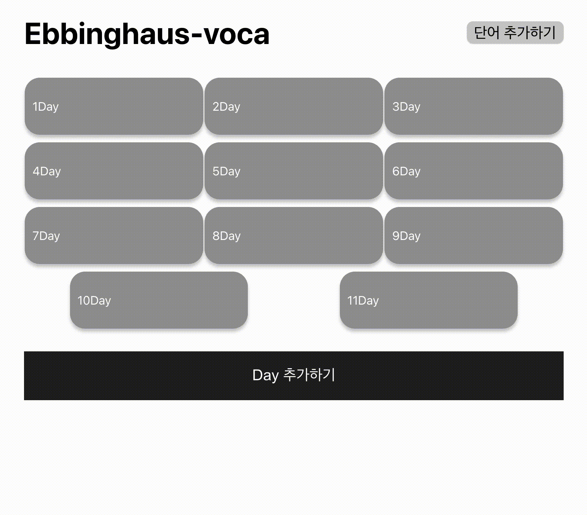
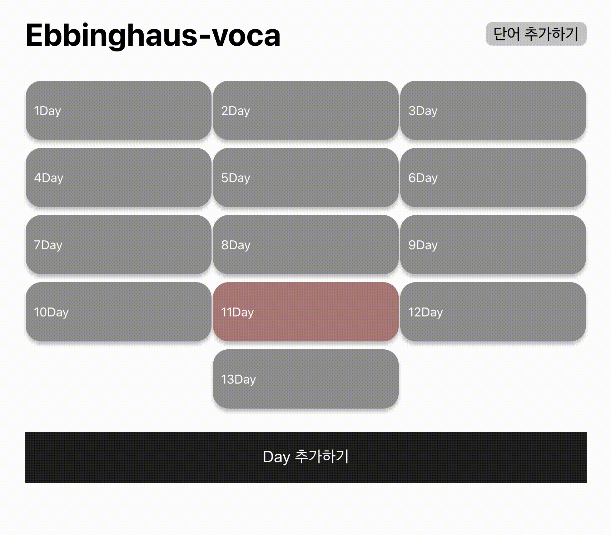

# Voca

영어 단어를 Day 별로 관리할 수 있는 단어장 앱입니다. day 페이지에서 단어를 추가할 수 있고, 외움 표시 삭제가 가능합니다. 단어 추가 페이지를 따로 두어서 날짜별로 한번에 추가할 수 있는 기능도 있습니다.

**사용 기술**

<p align='center'>
	
	
</p>

## 실행 환경 및 실행

서버가 있는 앱은 아니기 때문에 json-server 를 통해서 crud를 구현했습니다.

json server 실행 :

```
$ npm run json
```

react 실행 :

```
$ npm start
```

## 기능

### 1. day

<p align="center"></p>

day 추가 기능

### 2. 단어

- 날짜별 페이지에서

<p align="center"></p>

1. 단어 생성 폼을 활용하여 단어 생성
2. 단어 뜻 보기 , 뜻 숨기기 기능
3. 단어 외움 표시 기능
4. 단어 삭제 기능

- 단어 추가 페이지에서

<p align="center"></p>

단어 생성 페이지에서는 다른 날짜에 추가 사항을 모두 취함한 후에 한번에 추가할 수 있다. dqy1과 day2, day3 에 추가할 단어들을 모두 모은 후 한번에 추가한다.
